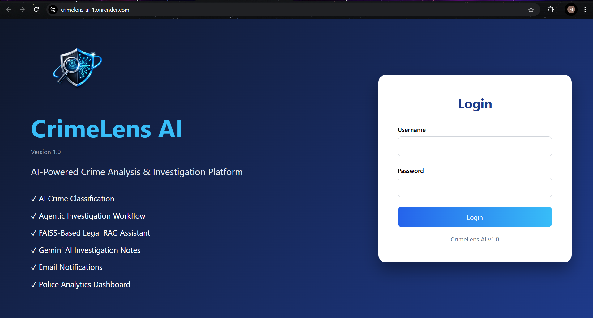
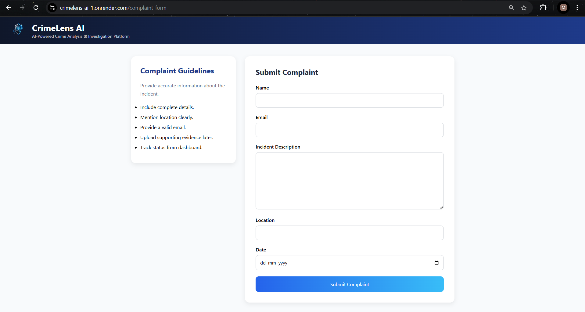
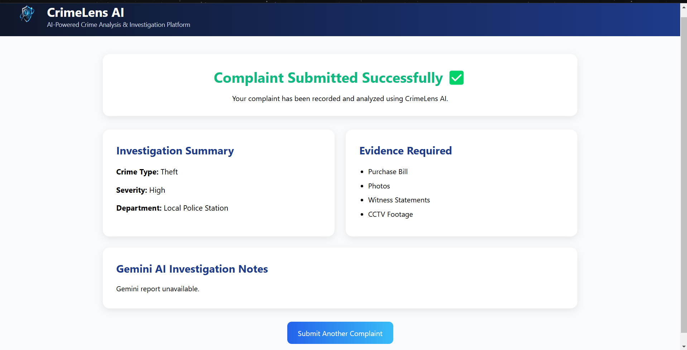
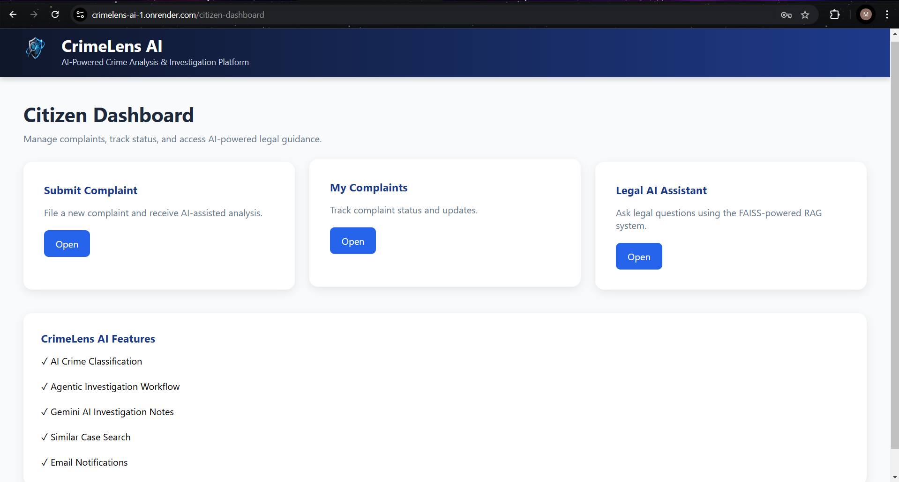
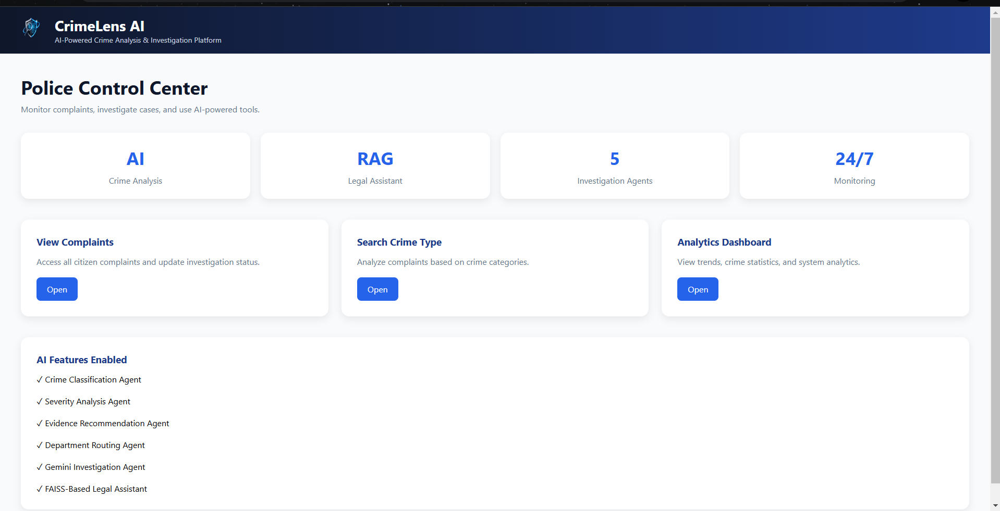
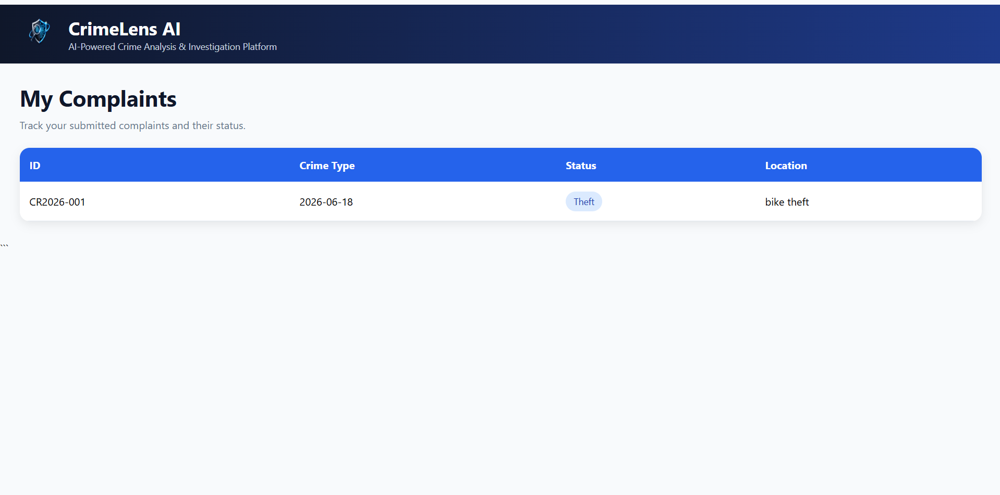
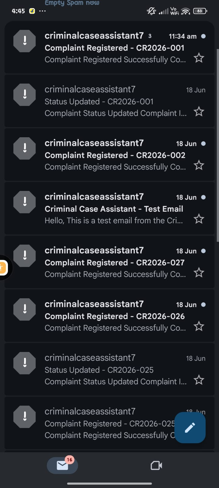

# CrimeLens AI

## AI-Powered Crime Analysis and Investigation Platform

CrimeLens AI is an intelligent crime complaint management and investigation platform that leverages Artificial Intelligence, Generative AI, and Agentic Workflows to assist both citizens and law enforcement agencies.

The platform enables citizens to register complaints online while helping police officers classify crimes, analyze severity, generate investigation reports, and manage cases efficiently using AI-generated insights.

---

# Live Demo

### Render Deployment

https://your-render-url.onrender.com

### Demo Version (Full Functionality Including Email)

Available through ngrok during demonstrations.

---

# Project Overview

CrimeLens AI streamlines crime complaint management by integrating AI-powered analysis into the investigation process.

The system automatically:

* Registers citizen complaints
* Classifies crime categories
* Analyzes complaint severity
* Generates investigation reports
* Produces Gemini AI investigation notes
* Stores and tracks complaint status
* Supports police investigation workflows
* Sends automated email notifications

---

# Key Features

## Citizen Portal

* Secure User Login
* Online Complaint Registration
* Complaint Tracking
* Complaint Status Monitoring
* AI-Powered Complaint Processing
* Automated Email Notifications

## Police Portal

* View Registered Complaints
* Complaint Management Dashboard
* Status Update System
* Investigation Workflow Management
* Similar Case Analysis
* AI Investigation Assistance

## AI & Generative AI Features

* AI-Based Crime Classification
* Crime Severity Analysis Agent
* Investigation Report Generation Agent
* Agentic Investigation Workflow
* Google Gemini AI Integration
* Generative AI Investigation Notes
* Automated Evidence Recommendation System

## Email Notification System

* Complaint Registration Emails
* Status Update Notifications
* Gmail SMTP Integration

---

# Technology Stack

## Backend Development

* Python
* FastAPI
* Uvicorn
* Jinja2 Templates

## Artificial Intelligence & Generative AI

* Google Gemini AI
* Agentic AI Investigation Workflow
* AI-Based Crime Classification
* Crime Severity Analysis Agent
* Investigation Report Generation Agent
* Automated Evidence Recommendation System
* Generative AI Investigation Notes

## Database

* SQLite3

## Frontend

* HTML5
* CSS3
* JavaScript

## Email Integration

* SMTP (Gmail)
* Python smtplib
* EmailMessage API

## Authentication & Security

* Session-Based Login System
* Role-Based Access Control
* Citizen & Police User Management

## Deployment & DevOps

* Git
* GitHub
* Render
* ngrok

## Development Tools

* Visual Studio Code
* PowerShell

---

# System Architecture

Citizen Complaint Submission

↓

AI Crime Classification

↓

Crime Severity Analysis Agent

↓

Investigation Report Generation Agent

↓

Gemini AI Investigation Notes

↓

Complaint Database Storage

↓

Police Investigation Dashboard

↓

Status Updates & Notifications

---

# Project Screenshots

## Login Page



---

## Complaint Registration Form



---

## Complaint Submitted Successfully



---

## Citizen Dashboard



---

## Police Dashboard



---

## Police Analytics Dashboard


---

## Police Complaint Management


---

## User Complaint Tracking



---

## Gmail Notification



---

# Installation Guide

## Clone Repository

```bash
git clone https://github.com/shafeeq-28/CrimeLens-AI.git
cd CrimeLens-AI
```

## Install Dependencies

```bash
pip install -r requirements.txt
```

## Run Application

```bash
python -m uvicorn main:app --reload
```

## Open Browser

```text
http://127.0.0.1:8000
```

---

# Future Enhancements

* Retrieval-Augmented Generation (RAG)
* FAISS Vector Database Integration
* Hugging Face Embeddings
* Advanced Crime Analytics
* Real-Time Monitoring Dashboard
* Mobile Application
* Multi-Language Support
* Cloud Database Migration

---

# Author

**Mohammed Shafeeq M**

B.E Electronics and Communication Engineering (ECE)

Sri Sairam Engineering College

---
