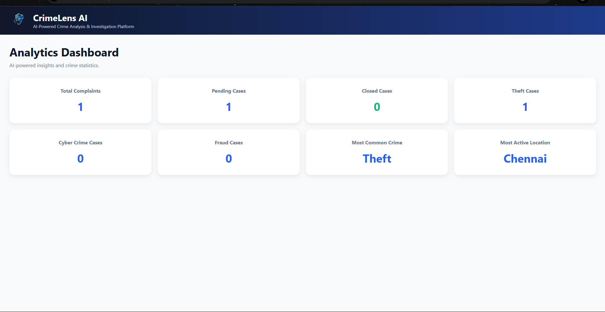
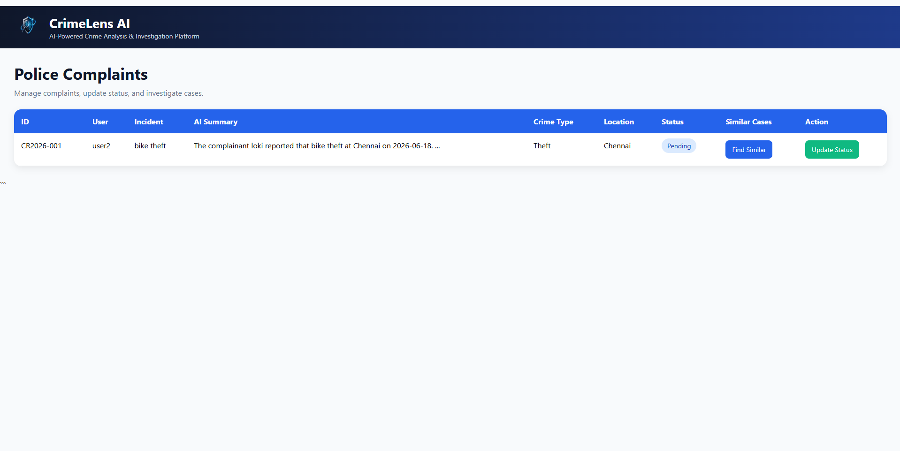

# CrimeLens AI

AI-Powered Crime Analysis and Investigation Platform using FastAPI, Gemini AI, SQLite, and Agentic Investigation Workflows.

## Overview

CrimeLens AI is an intelligent crime complaint management platform that helps citizens register complaints while assisting law enforcement agencies through AI-powered crime classification, investigation report generation, severity analysis, and automated case management.

The system enables citizens to submit complaints online and provides police officers with analytical tools to investigate cases efficiently.

---

## Features

### Citizen Portal

* User Login System
* Submit Crime Complaints
* AI-Based Crime Classification
* Complaint Tracking
* Investigation Report Generation
* Gemini AI Investigation Notes

### Police Portal

* View Registered Complaints
* Crime Analytics Dashboard
* Update Complaint Status
* Similar Case Search
* Investigation Management

### AI Features

* Crime Type Classification
* Severity Analysis Agent
* Investigation Report Agent
* Gemini AI Generated Investigation Notes
* Automated Evidence Suggestions

---

## Technology Stack

### Backend

* FastAPI
* Python
* SQLite

### AI & Machine Learning

* Google Gemini AI
* Agentic Investigation Workflows

### Frontend

* HTML
* CSS
* Jinja2 Templates

### Deployment

* Render
* GitHub
* ngrok (for live demonstrations)

---

## Project Screenshots

### Login Page


### Complaint Submission Form


### Complaint Submitted Successfully


### Police Dashboard


### Citizen Dashboard


### Police Analytics Dashboard



### Police View Complaints



### User Complaint Tracking


---

## Installation

Clone the repository:

```bash
git clone https://github.com/shafeeq-28/CrimeLens-AI.git
cd CrimeLens-AI
```

Install dependencies:

```bash
pip install -r requirements.txt
```

Run the application:

```bash
python -m uvicorn main:app --reload
```

Open:

```text
http://127.0.0.1:8000
```

---

## Future Enhancements

* Retrieval-Augmented Generation (RAG) Integration
* Real-Time Email Notifications
* Advanced Crime Analytics
* Mobile Application
* Multi-Language Support

---

## Author

Mohammed Shafeeq M

B.E Electronics and Communication Engineering (ECE)

Sri Sairam Engineering College
